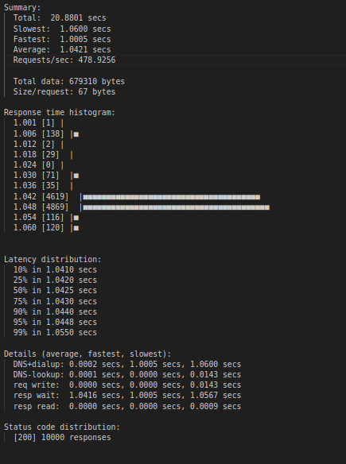

# Load Balncers
This is a reseacrh for difference between load balancers to find the best for differenret use cases.

## HAProxy
tested with 3 replica of app and each has 4 workers whcih is equal to **( 4 (workers) * 3 (replica) = 12)** it mean it can handle 12 conncurent request and to distribute the load evenly and manage all the upcoming request efficinelty we use haproxy.

### TEST with hey tool
> Total Requests 10,000 and 500 conncurrent client requesting our applicaiton on localhost:80 **http**
#### Results :
